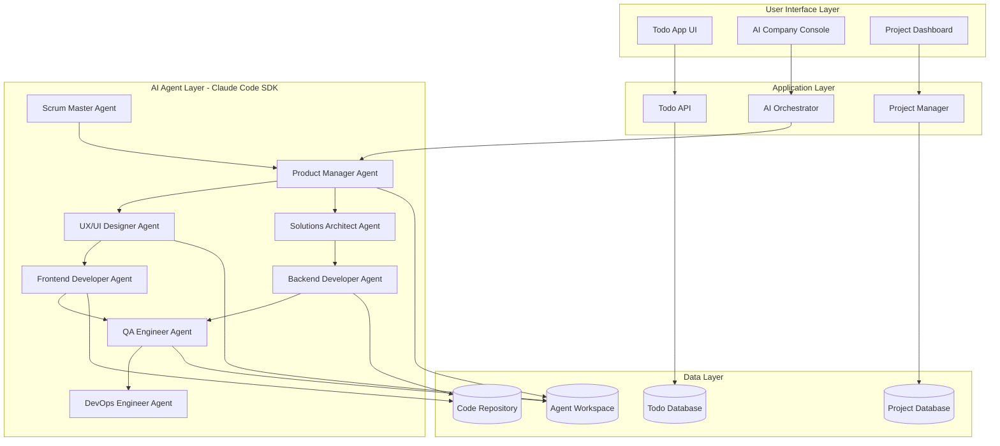

# Design Document

## Overview

The AI Todo Builder is a modern web application that combines a sleek todo list interface with an intelligent AI software company backend. The system uses Claude Code SDK to orchestrate multiple specialized AI agents that collaborate like a real software development team to implement user-requested features in real-time.

The architecture separates the user-facing todo application from the AI development environment, allowing the AI team to modify and extend the todo app while maintaining data integrity and user experience continuity.

## Architecture

### Claude Code Integration Strategy

The system leverages Claude Code's native capabilities to create a realistic software company experience:

**Sub-Agent Architecture:**
- Each AI role (PM, Designer, Developer, etc.) is implemented as a Claude Code sub-agent
- Sub-agents have specialized system prompts and tool access appropriate to their role
- Project-level sub-agents stored in `.claude/agents/` for team collaboration
- Each sub-agent maintains its own context window for focused expertise

**Hook-Driven Automation:**
- PreToolUse hooks validate code changes and enforce quality standards
- PostToolUse hooks trigger automated testing and code formatting
- SubAgentStop hooks coordinate handoffs between team members
- Notification hooks provide real-time updates to users about progress

**SDK Orchestration:**
- Main orchestrator uses Claude Code SDK to manage multiple concurrent sessions
- Streaming JSON output provides real-time progress updates
- Session management enables long-running development projects
- File system access allows agents to directly modify the todo application

### High-Level Architecture



### Technology Stack

**Frontend:**
- React 18 with TypeScript for the todo app UI
- Next.js for server-side rendering and API routes
- Tailwind CSS for modern, responsive styling
- React Query for state management and API caching
- Socket.io for real-time updates from AI agents

**Backend:**
- Node.js with Express.js for the main API server
- Claude Code SDK for AI agent orchestration and execution
- PostgreSQL for persistent data storage
- Redis for session management and real-time communication
- Docker for containerization and deployment

**AI Agent Infrastructure:**
- Claude Code SDK with persistent sessions for each specialized agent
- Claude Code Sub-agents for role-specific AI personalities
- Claude Code Hooks for automated workflow triggers
- Shared workspace with file system access for code collaboration
- Git integration for version control and code review processes

## Components and Interfaces

### 1. Todo Application Core

**TodoManager Component**
```typescript
interface TodoItem {
  id: string;
  title: string;
  description?: string;
  completed: boolean;
  createdAt: Date;
  updatedAt: Date;
  metadata: Record<string, any>; // Extensible for AI-added features
}

interface TodoAPI {
  getTodos(): Promise<TodoItem[]>;
  createTodo(todo: Omit<TodoItem, 'id' | 'createdAt' | 'updatedAt'>): Promise<TodoItem>;
  updateTodo(id: string, updates: Partial<TodoItem>): Promise<TodoItem>;
  deleteTodo(id: string): Promise<void>;
}
```

**Dynamic Feature Registry**
```typescript
interface FeatureDefinition {
  id: string;
  name: string;
  version: string;
  components: React.ComponentType[];
  apiEndpoints: APIEndpoint[];
  databaseMigrations: Migration[];
  enabled: boolean;
}

interface FeatureRegistry {
  registerFeature(feature: FeatureDefinition): void;
  enableFeature(featureId: string): void;
  disableFeature(featureId: string): void;
  getActiveFeatures(): FeatureDefinition[];
}
```

### 2. AI Agent System

**Claude Code Sub-Agent Configuration**
```typescript
interface SubAgentConfig {
  name: string;
  description: string;
  tools?: string[]; // Optional - inherits all tools if omitted
  systemPrompt: string;
  workspace: string;
}

interface AIAgent {
  id: string;
  role: AgentRole;
  subAgentConfig: SubAgentConfig;
  session: ClaudeCodeSession;
  
  initialize(): Promise<void>;
  processTask(task: Task): Promise<TaskResult>;
  delegateToSubAgent(taskDescription: string): Promise<TaskResult>;
  getStatus(): AgentStatus;
}

enum AgentRole {
  PRODUCT_MANAGER = 'product-manager',
  UX_DESIGNER = 'ux-designer', 
  ARCHITECT = 'solutions-architect',
  FRONTEND_DEV = 'frontend-developer',
  BACKEND_DEV = 'backend-developer',
  QA_ENGINEER = 'qa-engineer',
  DEVOPS = 'devops-engineer',
  SCRUM_MASTER = 'scrum-master'
}
```

**Agent Communication System**
```typescript
interface AgentMessage {
  id: string;
  from: string;
  to: string | 'broadcast';
  type: MessageType;
  content: any;
  timestamp: Date;
  threadId?: string;
  sessionId: string; // Claude Code session ID
}

interface CommunicationHub {
  sendMessage(message: AgentMessage): Promise<void>;
  subscribeToMessages(agentId: string, callback: (message: AgentMessage) => void): void;
  createThread(participants: string[], topic: string): string;
  getMessageHistory(threadId: string): Promise<AgentMessage[]>;
  bridgeSubAgentCommunication(fromSession: string, toSession: string, message: any): Promise<void>;
}

// Claude Code Hook Integration
interface WorkflowHook {
  event: 'PreToolUse' | 'PostToolUse' | 'Notification' | 'Stop' | 'SubAgentStop';
  matcher: string;
  command: string;
  description: string;
}
```

### 3. Project Management System

**Project Orchestrator**
```typescript
interface Project {
  id: string;
  title: string;
  description: string;
  status: ProjectStatus;
  assignedAgents: string[];
  timeline: ProjectTimeline;
  deliverables: Deliverable[];
  createdAt: Date;
}

interface ProjectOrchestrator {
  createProject(userRequest: string): Promise<Project>;
  assignAgents(projectId: string, roles: AgentRole[]): Promise<void>;
  trackProgress(projectId: string): Promise<ProjectProgress>;
  handleAgentHandoff(from: string, to: string, context: any): Promise<void>;
}
```

### 4. Code Generation and Integration

**Claude Code SDK Integration**
```typescript
interface CodeGenerator {
  generateComponent(specification: ComponentSpec): Promise<GeneratedCode>;
  generateAPI(specification: APISpec): Promise<GeneratedCode>;
  generateTests(codeContext: CodeContext): Promise<GeneratedCode>;
  integrateFeature(feature: FeatureDefinition): Promise<IntegrationResult>;
}

interface ClaudeCodeSDKWrapper {
  query(prompt: string, options: ClaudeCodeOptions): AsyncGenerator<SDKMessage>;
  createSubAgent(config: SubAgentConfig): Promise<string>;
  invokeSubAgent(agentName: string, task: string): Promise<TaskResult>;
  installHook(hook: WorkflowHook): Promise<void>;
  getSessionHistory(sessionId: string): Promise<SDKMessage[]>;
}

interface GeneratedCode {
  files: CodeFile[];
  dependencies: string[];
  migrations: Migration[];
  tests: TestFile[];
  sessionId: string; // Track which Claude Code session generated this
}
```

## Data Models

### Core Todo Data Model

```sql
-- Core todo table with extensible metadata
CREATE TABLE todos (
    id UUID PRIMARY KEY DEFAULT gen_random_uuid(),
    title VARCHAR(255) NOT NULL,
    description TEXT,
    completed BOOLEAN DEFAULT FALSE,
    metadata JSONB DEFAULT '{}',
    created_at TIMESTAMP DEFAULT NOW(),
    updated_at TIMESTAMP DEFAULT NOW()
);

-- Feature-specific extensions (managed by AI agents)
CREATE TABLE todo_extensions (
    id UUID PRIMARY KEY DEFAULT gen_random_uuid(),
    todo_id UUID REFERENCES todos(id) ON DELETE CASCADE,
    feature_id VARCHAR(100) NOT NULL,
    data JSONB NOT NULL,
    created_at TIMESTAMP DEFAULT NOW()
);
```

### AI Project Management Data Model

```sql
-- Projects created by user requests
CREATE TABLE projects (
    id UUID PRIMARY KEY DEFAULT gen_random_uuid(),
    title VARCHAR(255) NOT NULL,
    description TEXT,
    user_request TEXT NOT NULL,
    status VARCHAR(50) DEFAULT 'planning',
    created_at TIMESTAMP DEFAULT NOW(),
    completed_at TIMESTAMP
);

-- Agent assignments and work tracking
CREATE TABLE agent_assignments (
    id UUID PRIMARY KEY DEFAULT gen_random_uuid(),
    project_id UUID REFERENCES projects(id) ON DELETE CASCADE,
    agent_role VARCHAR(50) NOT NULL,
    agent_id VARCHAR(100) NOT NULL,
    status VARCHAR(50) DEFAULT 'assigned',
    started_at TIMESTAMP,
    completed_at TIMESTAMP
);

-- Inter-agent communication log
CREATE TABLE agent_messages (
    id UUID PRIMARY KEY DEFAULT gen_random_uuid(),
    project_id UUID REFERENCES projects(id) ON DELETE CASCADE,
    from_agent VARCHAR(100) NOT NULL,
    to_agent VARCHAR(100),
    message_type VARCHAR(50) NOT NULL,
    content JSONB NOT NULL,
    thread_id UUID,
    created_at TIMESTAMP DEFAULT NOW()
);

-- Generated code and deliverables
CREATE TABLE deliverables (
    id UUID PRIMARY KEY DEFAULT gen_random_uuid(),
    project_id UUID REFERENCES projects(id) ON DELETE CASCADE,
    agent_id VARCHAR(100) NOT NULL,
    type VARCHAR(50) NOT NULL, -- 'code', 'design', 'documentation', 'test'
    name VARCHAR(255) NOT NULL,
    content TEXT NOT NULL,
    metadata JSONB DEFAULT '{}',
    created_at TIMESTAMP DEFAULT NOW()
);
```

### Feature Registry Data Model

```sql
-- AI-implemented features
CREATE TABLE features (
    id VARCHAR(100) PRIMARY KEY,
    name VARCHAR(255) NOT NULL,
    description TEXT,
    version VARCHAR(20) NOT NULL,
    enabled BOOLEAN DEFAULT TRUE,
    project_id UUID REFERENCES projects(id),
    installed_at TIMESTAMP DEFAULT NOW()
);

-- Feature dependencies and conflicts
CREATE TABLE feature_dependencies (
    id UUID PRIMARY KEY DEFAULT gen_random_uuid(),
    feature_id VARCHAR(100) REFERENCES features(id) ON DELETE CASCADE,
    depends_on VARCHAR(100) REFERENCES features(id) ON DELETE CASCADE,
    dependency_type VARCHAR(50) DEFAULT 'required'
);
```

## Error Handling

### Agent Error Recovery

1. **Agent Failure Recovery**
   - Each agent maintains checkpoints of work progress
   - Failed agents can be restarted from last checkpoint
   - Backup agents can take over critical tasks

2. **Communication Failures**
   - Message queue with retry mechanisms
   - Fallback communication channels
   - Timeout handling with escalation to Scrum Master

3. **Code Integration Failures**
   - Automatic rollback to previous working state
   - Sandbox testing before integration
   - Conflict resolution through architect agent

### Data Integrity Protection

1. **Feature Installation Safety**
   - Database migrations in transactions
   - Backup creation before major changes
   - Feature isolation to prevent data corruption

2. **User Data Protection**
   - Immutable core todo data structure
   - Feature extensions in separate tables
   - Automatic data validation and repair

## Testing Strategy

### Multi-Level Testing Approach

1. **Unit Testing**
   - Each AI agent includes unit test generation
   - Generated code includes comprehensive test suites
   - Automated test execution in Claude Code environments

2. **Integration Testing**
   - Agent collaboration testing
   - Feature integration testing
   - API endpoint testing

3. **End-to-End Testing**
   - User workflow testing
   - AI development process testing
   - Performance and reliability testing

### AI Agent Testing

1. **Agent Behavior Testing**
   - Mock agent interactions
   - Communication protocol testing
   - Task completion verification

2. **Code Quality Assurance**
   - AI-generated code review processes
   - Automated code quality checks
   - Security vulnerability scanning

### Continuous Testing

1. **Real-time Testing**
   - Tests run automatically as agents generate code
   - Immediate feedback to development agents
   - Continuous integration pipeline

2. **User Acceptance Testing**
   - Automated user scenario testing
   - Performance benchmarking
   - Accessibility compliance testing

## Sub-Agent Configurations

### Product Manager Sub-Agent
```markdown
---
name: product-manager
description: Requirements analysis and user story creation. Use proactively for feature planning and stakeholder communication.
tools: Read, Write, Grep
---

You are a senior product manager specializing in feature requirements and user experience.

When invoked:
1. Analyze user feature requests for clarity and feasibility
2. Create detailed user stories with acceptance criteria
3. Identify dependencies and potential conflicts
4. Communicate with stakeholders for clarification
5. Create project specifications and timelines

Focus on user value, technical feasibility, and clear communication.
```

### UX Designer Sub-Agent
```markdown
---
name: ux-designer
description: UI/UX design and user experience optimization. Use proactively for interface design and user flow creation.
tools: Read, Write, Bash
---

You are a senior UX/UI designer focused on creating intuitive user experiences.

When invoked:
1. Create wireframes and mockups for new features
2. Design user flows and interaction patterns
3. Ensure accessibility compliance
4. Create design specifications for developers
5. Conduct usability analysis

Prioritize user-centered design, accessibility, and modern UI patterns.
```

### Frontend Developer Sub-Agent
```markdown
---
name: frontend-developer
description: React/TypeScript frontend development. Use proactively for UI implementation and component creation.
tools: Read, Write, Edit, Bash, Grep, Glob
---

You are a senior frontend developer specializing in React and TypeScript.

When invoked:
1. Implement UI components based on design specifications
2. Write clean, maintainable React code with TypeScript
3. Ensure responsive design and accessibility
4. Write comprehensive unit tests
5. Optimize performance and bundle size

Follow React best practices, use modern hooks, and ensure type safety.
```

### Backend Developer Sub-Agent
```markdown
---
name: backend-developer
description: Node.js/Express API development and database operations. Use proactively for server-side implementation.
tools: Read, Write, Edit, Bash, Grep, Glob
---

You are a senior backend developer specializing in Node.js and database design.

When invoked:
1. Design and implement REST APIs
2. Create database schemas and migrations
3. Implement business logic and data validation
4. Write comprehensive API tests
5. Ensure security and performance

Focus on scalable architecture, data integrity, and API best practices.
```

### QA Engineer Sub-Agent
```markdown
---
name: qa-engineer
description: Testing and quality assurance. Use proactively after code changes for comprehensive testing.
tools: Read, Write, Bash, Grep, Glob
---

You are a senior QA engineer focused on comprehensive testing strategies.

When invoked:
1. Create test plans and test cases
2. Write automated tests (unit, integration, e2e)
3. Perform manual testing for edge cases
4. Validate accessibility and performance
5. Report bugs with detailed reproduction steps

Ensure comprehensive coverage and maintain high quality standards.
```

### DevOps Engineer Sub-Agent
```markdown
---
name: devops-engineer
description: Deployment, CI/CD, and infrastructure management. Use proactively for deployment and monitoring.
tools: Read, Write, Bash, Grep, Glob
---

You are a senior DevOps engineer specializing in deployment and infrastructure.

When invoked:
1. Set up CI/CD pipelines
2. Configure deployment environments
3. Monitor application performance
4. Manage database migrations
5. Ensure security and backup procedures

Focus on automation, reliability, and scalable infrastructure.
```

## Security Considerations

### AI Agent Security

1. **Claude Code Session Isolation**
   - Each sub-agent runs in its own Claude Code session with isolated context
   - Tool access is explicitly configured per sub-agent role
   - File system access is limited to project workspace
   - Network access controlled through Claude Code's security model

2. **Hook-Based Security Controls**
   - PreToolUse hooks validate all code changes before execution
   - File protection hooks prevent modification of sensitive files
   - Custom permission hooks for deployment and production operations
   - Automated security scanning through PostToolUse hooks

### Data Security

1. **User Data Protection**
   - Encryption at rest and in transit
   - Access control and audit logging
   - GDPR compliance for user data

2. **Generated Code Security**
   - Static analysis of generated code
   - Runtime security monitoring
   - Input validation and sanitization

## Performance Optimization

### Agent Performance

1. **Parallel Processing**
   - Multiple agents work simultaneously
   - Task distribution optimization
   - Resource allocation management

2. **Caching Strategy**
   - Agent workspace caching
   - Code generation result caching
   - Communication message caching

### Application Performance

1. **Frontend Optimization**
   - Code splitting for dynamic features
   - Lazy loading of AI-generated components
   - Real-time update optimization

2. **Backend Optimization**
   - Database query optimization
   - API response caching
   - Background task processing

## Recommendations

### Architecture Recommendations

**A1. Simplified Initial Architecture**
- **Recommendation**: Start with a hub-and-spoke model rather than fully mesh agent communication
- **Rationale**: Reduces complexity and potential race conditions during initial implementation
- **Proposed Architecture**:
```typescript
interface SimplifiedArchitecture {
  centralOrchestrator: AIOrchestrator;
  agentQueue: TaskQueue;
  singleActiveAgent: boolean; // Only one agent active at a time initially
  sequentialWorkflow: WorkflowState[];
}
```

**A2. Circuit Breaker Implementation**
- **Recommendation**: Implement circuit breakers for all AI agent operations
- **Rationale**: Prevents cascade failures and provides graceful degradation
- **Implementation**:
```typescript
interface CircuitBreaker {
  maxExecutionTime: 300000; // 5 minutes per agent task
  maxRetries: 3;
  fallbackMode: 'manual' | 'previous-version';
  userNotification: boolean;
}
```

**A3. Safe Code Integration Pipeline**
- **Recommendation**: Add mandatory safety checks before any code integration
- **Rationale**: Prevents system corruption from AI-generated code
- **Pipeline Stages**:
```typescript
interface SafetyPipeline {
  staticAnalysis: SecurityScanner;
  sandboxTesting: IsolatedEnvironment;
  userApproval: ApprovalGate;
  rollbackPlan: RollbackStrategy;
  monitoringHooks: HealthCheck[];
}
```

### Data Safety Recommendations

**A4. Enhanced Backup Strategy**
- **Recommendation**: Implement multi-tier backup system with versioning
- **Rationale**: Current backup strategy may not handle complex feature rollbacks
- **Enhanced Strategy**:
```typescript
interface EnhancedBackup {
  continuousBackup: boolean;
  featureSnapshots: FeatureSnapshot[];
  dependencyTracking: DependencyGraph;
  atomicRollback: boolean;
  userDataSeparation: boolean;
}
```

**A5. Feature Isolation Architecture**
- **Recommendation**: Design features as isolated modules to prevent cross-contamination
- **Rationale**: Reduces risk of feature conflicts and simplifies rollbacks
- **Implementation**:
```typescript
interface FeatureIsolation {
  moduleSystem: ModuleLoader;
  apiNamespacing: NamespaceStrategy;
  databasePartitioning: PartitionStrategy;
  cssIsolation: StyleIsolationMethod;
}
```

### Performance and Scalability Recommendations

**A6. Resource Management System**
- **Recommendation**: Implement comprehensive resource monitoring and limits
- **Rationale**: AI operations can be resource-intensive and need proper management
- **Resource Controls**:
```typescript
interface ResourceManagement {
  maxConcurrentAgents: number;
  memoryLimits: MemoryLimit[];
  cpuQuotas: CPUQuota[];
  networkThrottling: ThrottleConfig;
  costTracking: CostTracker;
}
```

**A7. Caching and Optimization Strategy**
- **Recommendation**: Implement intelligent caching for AI operations and generated code
- **Rationale**: Reduces AI usage costs and improves response times
- **Caching Strategy**:
```typescript
interface IntelligentCaching {
  agentResponseCache: LRUCache<AgentResponse>;
  codeGenerationCache: CodeCache;
  featureTemplateCache: TemplateCache;
  userPatternLearning: PatternRecognition;
}
```

### Agent Coordination Recommendations

**A8. Staged Agent Rollout**
- **Recommendation**: Implement agents incrementally with proven coordination patterns
- **Rationale**: Reduces complexity and allows for learning from each integration
- **Rollout Strategy**:
```typescript
interface StagedRollout {
  phase1: ['product-manager'];
  phase2: ['product-manager', 'frontend-developer'];
  phase3: ['product-manager', 'frontend-developer', 'ux-designer'];
  phase4: ['all-agents'];
  coordinationPatterns: CoordinationPattern[];
}
```

**A9. Enhanced Error Recovery**
- **Recommendation**: Implement sophisticated error recovery with context preservation
- **Rationale**: Agent failures should not lose user context or progress
- **Recovery System**:
```typescript
interface ErrorRecovery {
  contextCheckpointing: CheckpointManager;
  agentFailoverStrategy: FailoverStrategy;
  workRecovery: WorkRecoveryManager;
  userNotification: NotificationStrategy;
  manualOverride: OverrideCapability;
}
```

### Security Recommendations

**A10. Enhanced Security Model**
- **Recommendation**: Implement defense-in-depth security for AI operations
- **Rationale**: AI-generated code and agent access require robust security measures
- **Security Layers**:
```typescript
interface SecurityLayers {
  inputValidation: ValidationRules[];
  codeAnalysis: SecurityScanner;
  runtimeMonitoring: RuntimeSecurityMonitor;
  accessControl: RoleBasedAccess;
  auditLogging: AuditLogger;
}
```

**A11. User Data Protection**
- **Recommendation**: Implement strict data isolation and encryption
- **Rationale**: User todo data must be protected from AI processing and storage
- **Protection Measures**:
```typescript
interface DataProtection {
  encryptionAtRest: EncryptionConfig;
  encryptionInTransit: TLSConfig;
  dataMinimization: DataMinimizationPolicy;
  userConsent: ConsentManager;
  gdprCompliance: GDPRControls;
}
```

### Implementation Strategy Recommendations

**A12. Modular Development Approach**
- **Recommendation**: Design system as composable modules for easier testing and maintenance
- **Rationale**: Enables independent development and testing of components
- **Module Structure**:
```typescript
interface ModularArchitecture {
  coreModule: TodoCore;
  agentModule: AIAgentSystem;
  orchestrationModule: ProjectOrchestrator;
  uiModule: UserInterface;
  integrationModule: FeatureIntegrator;
}
```

**A13. Comprehensive Monitoring**
- **Recommendation**: Implement detailed monitoring for AI operations and system health
- **Rationale**: Complex AI systems require extensive observability for debugging and optimization
- **Monitoring Framework**:
```typescript
interface MonitoringFramework {
  agentMetrics: AgentPerformanceMetrics;
  systemHealth: HealthMetrics;
  userExperience: UXMetrics;
  costTracking: CostMetrics;
  businessMetrics: BusinessKPIs;
}
```

### Testing Recommendations

**A14. AI-Specific Testing Strategy**
- **Recommendation**: Develop specialized testing approaches for AI behavior validation
- **Rationale**: Traditional testing methods may not adequately cover AI agent behavior
- **Testing Approach**:
```typescript
interface AITestingStrategy {
  deterministicTests: DeterministicTestSuite;
  behaviorValidation: BehaviorTestFramework;
  integrationTesting: AgentIntegrationTests;
  userAcceptanceTesting: UATFramework;
  performanceBenchmarks: PerformanceSuite;
}
```